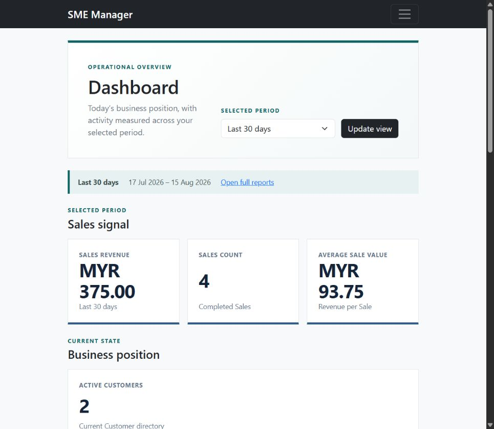
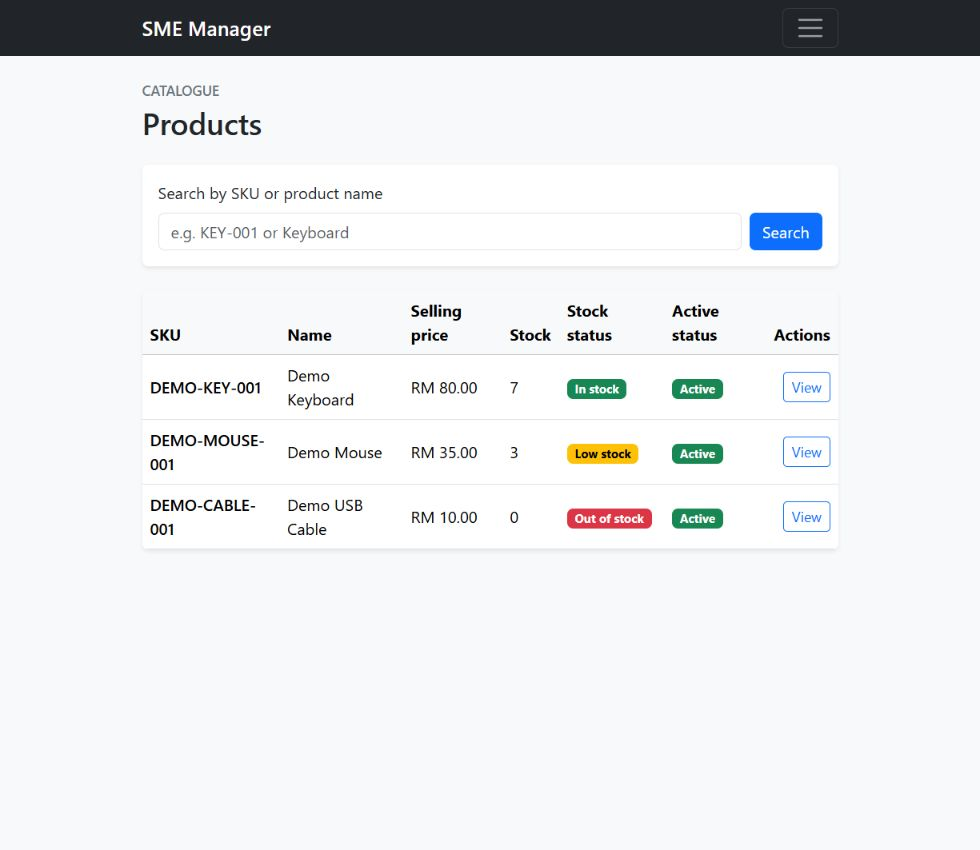
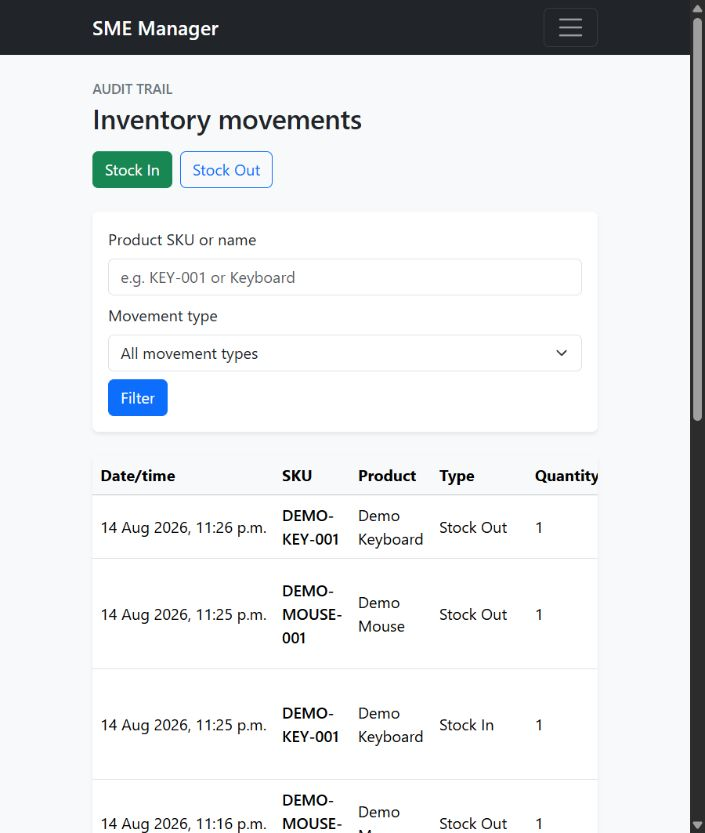
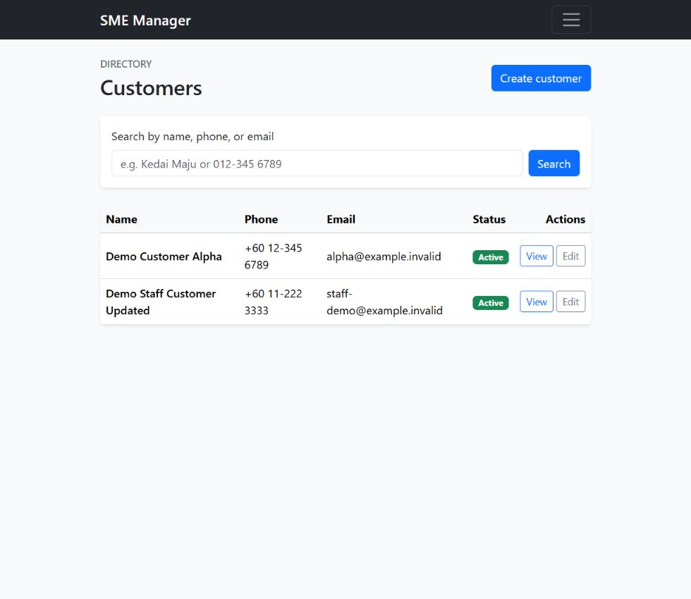
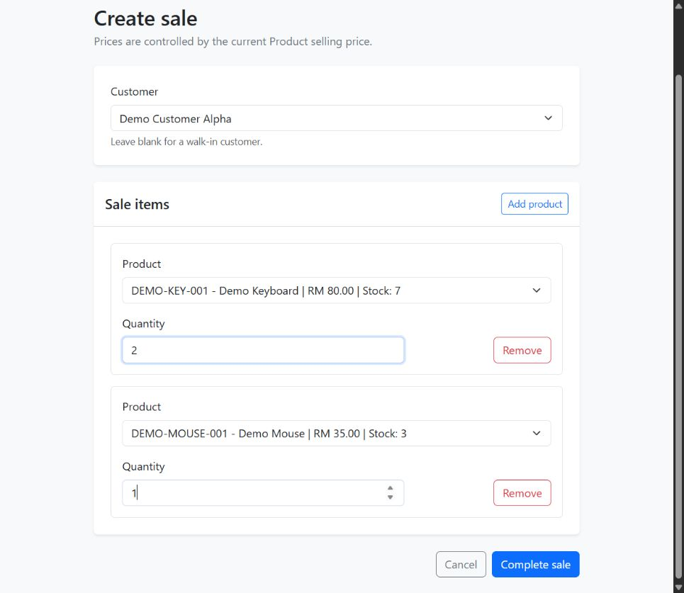
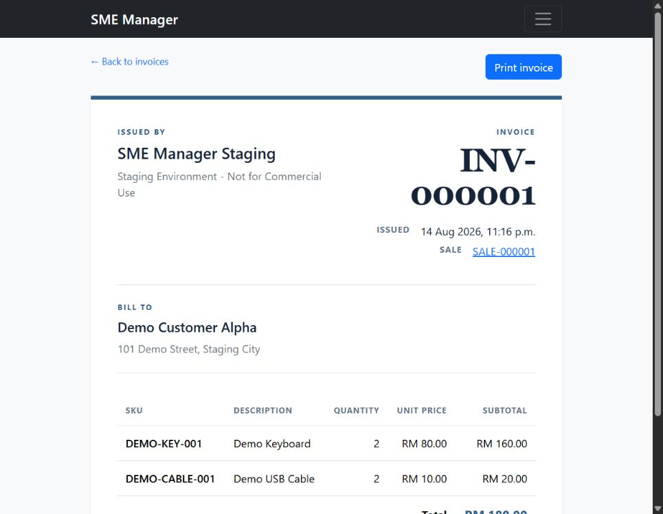
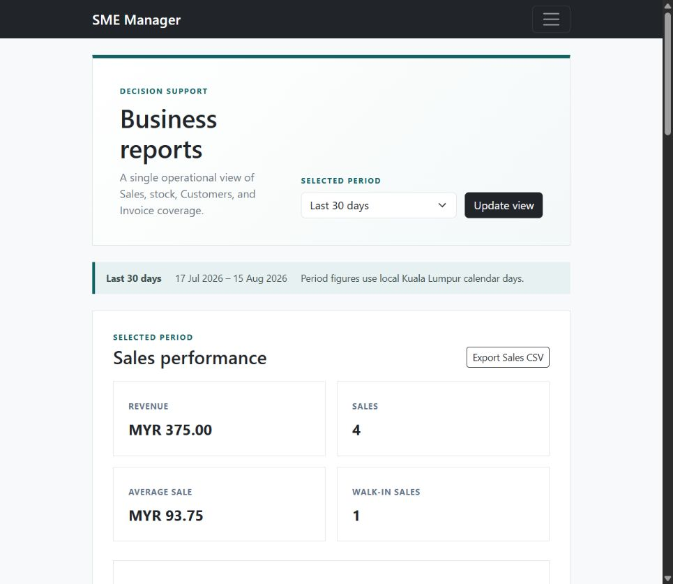
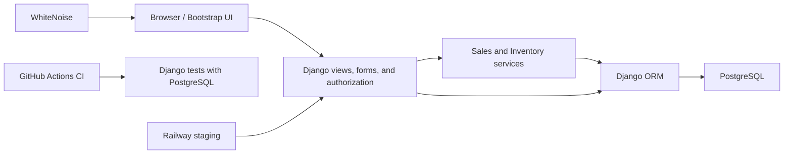

# SME Business Management & Inventory System

[](https://github.com/dickxenlee/SME-Business-Management-Inventory-System/actions/workflows/ci.yml)

A Django and PostgreSQL business system for managing products, stock, customers, completed Sales, immutable Invoices, and operational reporting through a server-rendered Bootstrap interface.

**[Live staging demo](https://sme-manager-web-staging.up.railway.app/): authentication required. Demo access can be provided on request.**

This is a portfolio and staging implementation. It does not claim commercial production usage, real customers, or production-scale traffic.

## Main features

- Role-based access for Django superusers (Admin) and members of the `Staff` group
- Staff account management, self-service password change, and email password reset that is hidden when no mail host is configured
- Searchable, paginated Product and Customer management with soft deactivation
- Transactional Stock In, Stock Out, and Adjustment workflows with an auditable movement chain
- Atomic multi-item Sales with stock validation, rollback, and immutable historical snapshots
- Payment capture (cash, card, e-wallet, transfer) with change calculated at the counter
- Sale voiding that returns stock and leaves revenue, recorded as a separate reversal so the original Sale is never edited
- Per-line discounts and configurable sales tax (SST), with the rate and label snapshotted onto each Sale
- One immutable Invoice per completed Sale with a tax breakdown and print-friendly browser output
- Dashboard and Reports for revenue, gross margin, Sales, inventory health, Customers, and Invoice coverage
- Secure CSV exports for Sales and Inventory Movements
- PostgreSQL-backed automated tests, GitHub Actions CI, health checks, and recovery documentation

## Screenshots

The interface below uses staging-only demonstration data. Account details, browser UI, hosting information, and private local information are excluded.

| Dashboard | Products |
|---|---|
|  |  |

| Inventory | Customers |
|---|---|
|  |  |

| Create a Sale | Immutable Invoice |
|---|---|
|  |  |



## Architecture



The application follows a conventional multi-app Django structure. Views handle HTTP concerns and server-side authorization; ModelForms validate user input; service functions own stock-changing and Sale-creation transactions; and PostgreSQL stores both current state and immutable audit history.

## Engineering highlights

### Transactional inventory and Sales

All stock changes pass through a centralized Inventory service. Each operation uses `transaction.atomic()` and `select_for_update()` so the Product balance and its StockMovement audit entry succeed or roll back together.

Multi-item Sales lock Products in deterministic primary-key order. The Sales service validates every line, creates the Sale, deducts stock through the Inventory service, links one StockMovement to each SaleItem, and commits the complete operation in one outer transaction. An invalid or understocked line rolls back the Sale, all SaleItems, all StockMovements, and every Product balance change.

### Historical integrity

Completed Sales and issued Invoices are immutable. SaleItems snapshot Product SKU, name, and unit price; Sales snapshot Customer name and address; and Invoice records copy the Sale history plus the configured seller identity. Later edits or deactivation of Products and Customers do not rewrite historical documents.

### Authorization and security

- Anonymous users are redirected to login for internal pages.
- Admin and Staff permissions are enforced in server-side views, not only in navigation.
- Normal Staff users remain outside Django admin.
- Destructive state changes use POST and CSRF protection; normal business records use soft deactivation.
- Production settings enforce secure cookies, HTTPS-aware configuration, explicit hosts/origins, and PostgreSQL TLS.
- The login form is rate limited: repeated failures lock the username/address pair for a cool-off period, recorded in PostgreSQL so the limit holds across Gunicorn workers.
- CSV exports neutralize user-controlled values that could be interpreted as spreadsheet formulas.

### Reporting

Dashboard and Reports support Today, the last 7 days, and the last 30 days using local-calendar boundaries. Revenue comes from immutable Sale totals, so issuing an Invoice never double-counts income. Chart.js adds daily revenue and top-Product visualizations while the underlying data remains available in HTML.

## Testing and CI

The project has **405 automated PostgreSQL-backed tests** covering models, forms, permissions, views, services, constraints, transaction rollback, concurrent stock operations, historical snapshots, gross-margin reporting, login lockout, CSV security, production settings, and health checks.

GitHub Actions runs the suite against a real PostgreSQL service and separately validates the production configuration. Local verification uses the same checks:

```powershell
python -m pip check
python manage.py check
python manage.py makemigrations --check
python manage.py migrate
python manage.py test
python manage.py collectstatic --noinput
```

## Deployment and recovery

The staging/demo environment is deployed on Railway with PostgreSQL, Gunicorn, WhiteNoise compressed manifest static files, secure environment-controlled settings, and the public readiness endpoint `/health/`.

Backup and recovery procedures are documented and have been exercised with a real staging archive restored into an isolated local PostgreSQL database. The restore drill verified its checksum and archive contents, Django migrations, record counts, users and roles, relational integrity, inventory movement chains, historical Sale and Invoice arithmetic, report totals, and Django system checks. The backup itself and all credentials remain outside Git.

See [Production deployment and recovery](docs/production-deployment.md) for environment requirements, HTTPS and trusted-proxy verification, migration and start commands, smoke tests, backup/restore steps, and rollback guidance.

## Technology stack

- Python 3.11+
- Django 5.2
- PostgreSQL and psycopg 3
- Bootstrap 5 and Chart.js
- Gunicorn and WhiteNoise
- GitHub Actions
- Railway staging

## Functional design notes

### Authentication and roles

- **Admin:** a Django superuser with full application access, Django admin access, and staff-user management.
- **Staff:** a user in the Django `Staff` group who can access approved business workflows but cannot enter Django admin unless separately granted Django permissions.

There is no public registration, social login, JWT authentication, or repository-stored account credential.

### Products and inventory

Staff can search, paginate, list, and view active Products. Admin can also view inactive Products, create and edit Products, and deactivate them without removing database rows.

New Products start with zero stock. Product forms omit stock, and Django admin shows it as read-only. Admin can Stock In, Stock Out, and Adjust; Staff can Stock In and Stock Out. An Adjustment records the final physical count and requires a reason. Inactive Products reject stock operations.

### Customers

Admin and Staff can create Customers and search by name, phone, or email. Admin can view and edit inactive records and deactivate Customers; Staff only sees and edits active Customers. Contact fields are optional, and duplicate phone numbers and email addresses are allowed.

### Sales

Admin and Staff can create a completed Sale for an active Customer or a walk-in customer. Product prices are controlled by the server. Completed Sales have no edit, cancellation, or deletion workflow in the application or Django admin.

### Invoices

Admin and Staff can manually issue one Invoice from a completed Sale. Invoice issuance does not change stock or Sales history. Invoices are searchable, read-only, and print-friendly; the browser's **Save as PDF** option can create a PDF copy.

## Local setup

### Requirements

- Python 3.11 or newer
- PostgreSQL
- Git

### 1. Create and activate a virtual environment

```powershell
python -m venv .venv
.\.venv\Scripts\Activate.ps1
python -m pip install --upgrade pip
python -m pip install -r requirements.txt
```

### 2. Create a PostgreSQL user and database

Open `psql` as a PostgreSQL administrator and run:

```sql
CREATE USER sme_manager_user WITH PASSWORD 'choose-a-strong-local-password';
CREATE DATABASE sme_manager OWNER sme_manager_user;
```

The application is PostgreSQL-only and does not silently fall back to SQLite.

PostgreSQL-backed tests create a temporary database. The local development role therefore needs `CREATEDB` while running tests:

```sql
ALTER ROLE sme_manager_user CREATEDB;
```

A production application role should not normally receive this permission.

### 3. Configure environment variables

```powershell
Copy-Item .env.example .env
python -c "import secrets; print(secrets.token_urlsafe(50))"
```

Put the generated value in `DJANGO_SECRET_KEY` and set the local database credentials in `.env`. The `.env` file is ignored by Git; never commit or share it.

| Variable | Description |
|---|---|
| `DJANGO_ENVIRONMENT` | `development`, `test`, or `production`; defaults to `development` |
| `DJANGO_SECRET_KEY` | Required private Django signing key |
| `DJANGO_DEBUG` | Local/test debug control; production always forces `False` |
| `DJANGO_ALLOWED_HOSTS` | Comma-separated host names or IP addresses |
| `DJANGO_CSRF_TRUSTED_ORIGINS` | Comma-separated HTTPS origins required in production |
| `DJANGO_TRUST_PROXY_SSL_HEADER` | Trust a verified platform proxy; production default is `True` and can be explicitly disabled |
| `DJANGO_SECURE_HSTS_SECONDS` | Production HSTS rollout value; defaults to `0` |
| `DJANGO_LOG_LEVEL` | Console logging threshold; defaults to `INFO` |
| `DB_NAME` | Required PostgreSQL database name |
| `DB_USER` | Required PostgreSQL user |
| `DB_PASSWORD` | Required PostgreSQL password |
| `DB_HOST` | PostgreSQL host; defaults to `localhost` |
| `DB_PORT` | PostgreSQL port; defaults to `5432` |
| `DB_SSLMODE` | PostgreSQL TLS mode; production requires `require`, `verify-ca`, or `verify-full` |
| `DB_CONNECT_TIMEOUT` | Connection timeout in seconds; defaults to `5` |
| `DB_CONN_MAX_AGE` | Connection reuse in seconds; defaults to `0` locally and `60` in production |
| `INVOICE_SELLER_NAME` | Required seller name copied onto each issued Invoice |
| `INVOICE_SELLER_ADDRESS` | Required seller address copied onto each issued Invoice |

Invoice issuance is rejected when either seller value is empty. Both values are snapshotted at issuance, so later configuration changes do not alter historical Invoices.

### 4. Prepare and run Django

```powershell
python manage.py migrate
python manage.py createsuperuser
python manage.py runserver
```

Open [http://127.0.0.1:8000/](http://127.0.0.1:8000/) and sign in to view the Dashboard. Administrators can create users in Django admin and assign normal business users to the `Staff` group.

## Production notes

Generated static output is written to `staticfiles/` and is not committed. Production runs Gunicorn on Linux, serves versioned static assets through WhiteNoise, and uses environment variables for all secrets and provider-specific settings.

Before any deployment, verify the current hosting provider's pricing, region availability, database limits, backup features, proxy behavior, and TLS requirements. Docker is intentionally outside the current project scope.
